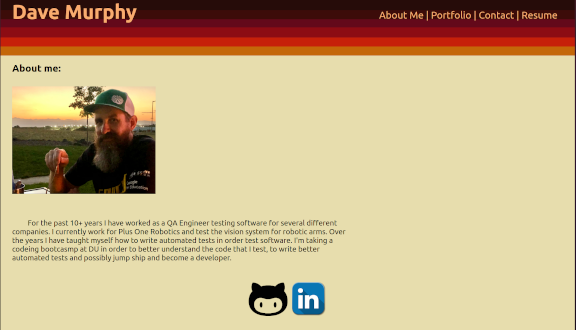

# React Portfolio

## Table of Contents

* [Description](#description)
* [Screenshot](#screenshot)
* [Installation](#installation)
* [License](#license)
* [Questions](#question)

## Description

I create a protfolio website using React! It contains 4 pages: About Me, Portfolio, Contact & Resume. The portfolio page shows off 6 projects I have completed  that demonstrate some of the front & backend proficiencies I have recently learned. 

## Screenshot

## Installation

The React Portfolio has been deployed to [GitHub pages](https://murda02.github.io/wk20-react-portfolio/)

## License

## Questions
Contact me at:
* [GitHub](https://github.com/murda02)
* [Email](mailto:davelmurphy@zoho.com)